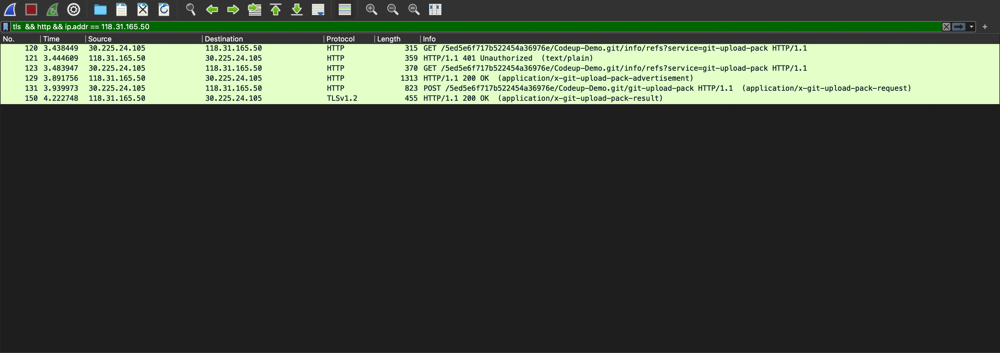
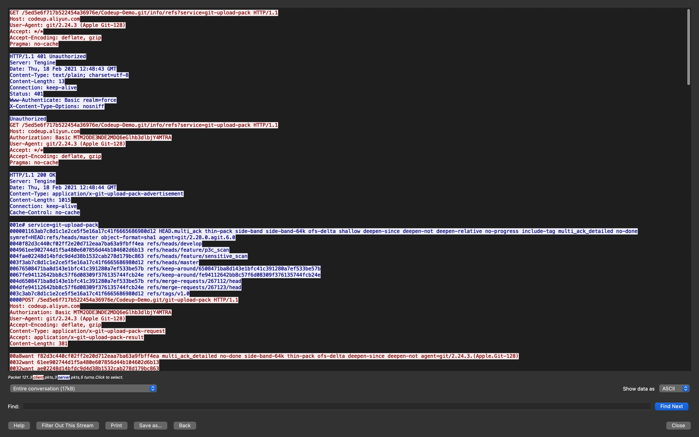

## Git 底层协议分析

### Wireshark 抓包分析 git https 传输协议

Wireshark 是一个抓包工具，该工具分析协议流很直观准确。

#### 准备工作
本文使用阿里云的代码托管平台 [Codeup](https://codeup.aliyun.com/) 来分析传输协议。当然，你也可以使用 [Github](https://github.com) 或者 [Gitee](https://gitee.com/) 。
> github 使用的是 [http/2 协议](https://developers.google.com/web/fundamentals/performance/http2?hl=zh-cn) 的协议。 http/2 协议因为数据帧是二进制格式，对于分析 https 交互并不直观，所以本文使用了Codeup作为示例，Codeup 使用的是 http/1.1 协议。

##### 1. 查看服务器 ip 地址
```c
host codeup.aliyun.com
codeup.aliyun.com has address 118.31.165.50
```
服务器 ip 地址为 `118.31.165.50` 。

##### 2. 设置 `SSLKEYLOGFILE` 环境变量
通过设置 `SSLKEYLOGFILE`环境变量，可以保存 TLS 的会话钥匙（session key），wireshark 再读取到session key 然后实时解析https数据流，具体见：[Walkthrough: Decrypt SSL/TLS traffic (HTTPS and HTTP/2) in Wireshark](https://joji.me/en-us/blog/walkthrough-decrypt-ssl-tls-traffic-https-and-http2-in-wireshark/#:~:text=The%20second%20method%20to%20decrypt%20SSL%2FTLS%20packets%20is,generate%20TLS%20session%20keys%20out%20to%20that%20file.)。

```bash
export SSLKEYLOGFILE=~/sslkeylog.log
```

##### 3. 设置 Wireshark
首先让 Wireshark 读取 `sslkeylog.log`，打开 Wireshark，点击 `菜单` >`Performances`，在对话框中选择 `Protocol` > `TLS`，设置 `(Pre)-Master-Secret log filename` 为你的 `SSLKEYLOGFILE` 文件路径：


启动wireshark 监听网卡，设置过滤规则为`tls && http && ip.addr == 118.31.165.50`，其中 `118.31.165.50`就是获取到的服务器 ip 地址。

#### git clone

做完上面的准备工作后，就开始抓包分析了。如下运行 `git clone` 命令：

```bash
# 确保设置了 SSLKEYLOGFILE 环境变量
# export SSLKEYLOGFILE=~/sslkeylog.log
$ git clone https://codeup.aliyun.com/5ed5e6f717b522454a36976e/Codeup-Demo.git
```
Wireshark 抓包得到如下数据包：



点击 `菜单` > `Analyze` > `Follow` > `HTTP Stream` 可以更直观的查看交互流：



如下绘制了git clone 的 https 协议交互图：

#### git fetch

#### git push

### 分析 git ssh 传输协议

#### git clone

#### git fetch

#### git push

### 


wireshark 过滤条件
tls && ip.addr == 118.31.165.50


http(s)://，ssh://，git://


```
HTTP/1.1 200 OK
Server: Tengine
Date: Thu, 18 Feb 2021 12:48:44 GMT
Content-Type: application/x-git-upload-pack-advertisement
Content-Length: 1015
Connection: keep-alive
Cache-Control: no-cache

001e# service=git-upload-pack
000001163ab7c8d1c1e2ce5f5e16a17c41f6665686980d12 HEADmulti_ack thin-pack side-band side-band-64k ofs-delta shallow deepen-since deepen-not deepen-relative no-progress include-tag multi_ack_detailed no-done symref=HEAD:refs/heads/master object-format=sha1 agent=git/2.28.0.agit.6.0
0040f82d3c440cf02ff2e20d712eaa7ba63a9fbff4ea refs/heads/develop
004961ee902744d1f5a480e607856d44b104602d6b13 refs/heads/feature/p3c_scan
004fae02248d14bfdc9d4d38b1532cab278d179bc863 refs/heads/feature/sensitive_scan
003f3ab7c8d1c1e2ce5f5e16a17c41f6665686980d12 refs/heads/master
00676508471ba8d143e1bfc41c391280a7ef533be57b refs/keep-around/6508471ba8d143e1bfc41c391280a7ef533be57b
0067fe94112642bb8c57f6d08309f376135744fcb24e refs/keep-around/fe94112642bb8c57f6d08309f376135744fcb24e
004d6508471ba8d143e1bfc41c391280a7ef533be57b refs/merge-requests/267112/head
004dfe94112642bb8c57f6d08309f376135744fcb24e refs/merge-requests/267123/head
003c3ab7c8d1c1e2ce5f5e16a17c41f6665686980d12 refs/tags/v1.0
0000
```


```
00a8want f82d3c440cf02ff2e20d712eaa7ba63a9fbff4ea multi_ack_detailed no-done side-band-64k thin-pack ofs-delta deepen-since deepen-not agent=git/2.24.3.(Apple.Git-128)
0032want 61ee902744d1f5a480e607856d44b104602d6b13
0032want ae02248d14bfdc9d4d38b1532cab278d179bc863
0032want 3ab7c8d1c1e2ce5f5e16a17c41f6665686980d12
0032want 3ab7c8d1c1e2ce5f5e16a17c41f6665686980d12
00000009done

```

每一行以一个四位的十六进制值开始，用于指明本行的长度。结尾0000 代表是完成了整个过程。


ssh 是建立在tcp之上的。
最后协商成功之后，将会生成一个对称加密 会话密钥key 以及一个 会话ID ，在这里要特别强调，这个是对称加密密钥key，


从服务器拉取 拉取 info/refs 文件内容。
```bash
`git --exec-path`/git-update-server-info && cat .git/info/refs
3ab7c8d1c1e2ce5f5e16a17c41f6665686980d12	refs/heads/master
3ab7c8d1c1e2ce5f5e16a17c41f6665686980d12	refs/remotes/origin/HEAD
f82d3c440cf02ff2e20d712eaa7ba63a9fbff4ea	refs/remotes/origin/develop
61ee902744d1f5a480e607856d44b104602d6b13	refs/remotes/origin/feature/p3c_scan
ae02248d14bfdc9d4d38b1532cab278d179bc863	refs/remotes/origin/feature/sensitive_scan
3ab7c8d1c1e2ce5f5e16a17c41f6665686980d12	refs/remotes/origin/master
3ab7c8d1c1e2ce5f5e16a17c41f6665686980d12	refs/tags/v1.0
```

上面使用wireshark 抓取到的协议叫智能（smart）协议，实际上 Git 1.6.6 之前的版本（2010年前）一直使用哑(Dumb)协议。使用哑协议的版本库很难保证安全性和私有化，而且只能架设只读版本库，目前已经很少使用了，哑协议的交互过程可以参考《[Git Internals - Transfer Protocols](https://git-scm.com/book/en/v2/Git-Internals-Transfer-Protocols)》。
### 参考资料

* https://git-scm.com/book/en/v2/Git-on-the-Server-The-Protocols
* https://git-scm.com/book/en/v2/Git-Internals-Transfer-Protocols
* https://wangdoc.com/ssh/client.html
* https://github.com/gcla/termshark