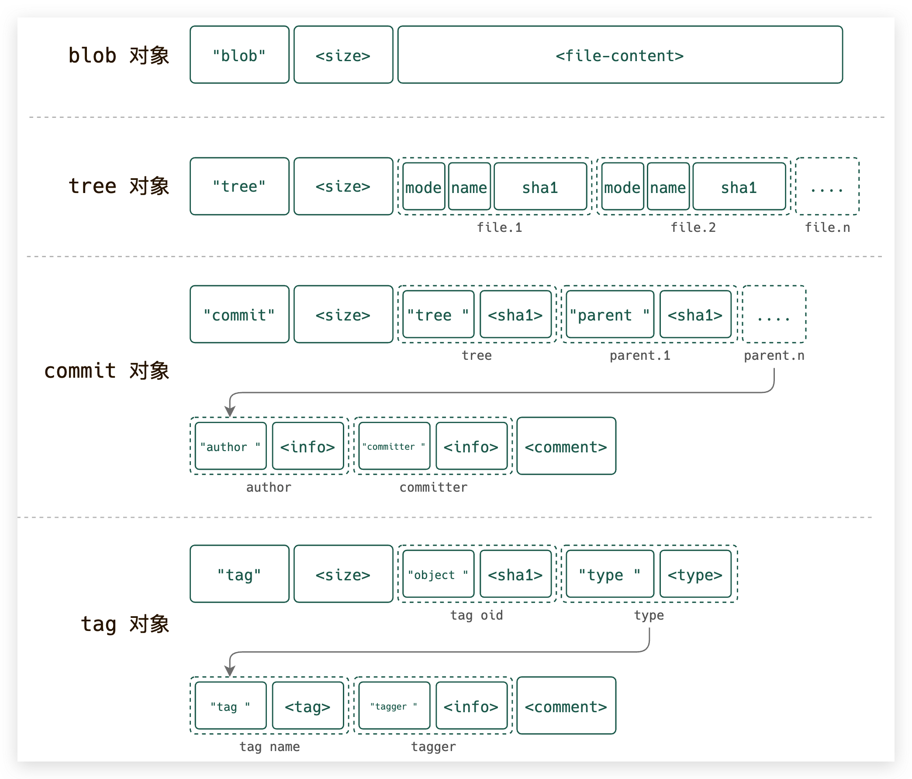

<h1 style="margin-top: 30px; margin-bottom: 15px; padding: 0px 100px; font-size: 22px; text-align: center; position: relative; font-weight: bold; color: black; line-height: 1.1em; padding-top: 12px; padding-bottom: 12px; margin: 70px 30px 30px; border: 1px solid #000; width: 60%; margin: 0 auto" data-id="heading-2"><span style="float: left; display: block; width: 0%; border-top: 1px solid #000; height: 1px; line-height: 1px; margin-left: -5px; margin-top: -17px;"> </span><span class="prefix" style="display: block; width: 3px; margin: 0 0 0 5%; height: 3px; line-height: 3px; overflow: hidden; background-color: #000; box-shadow: 3px 0 #000, 0 3px #000, -3px 0 #000, 0 -3px #000;"></span><span class="content" style="display: block; -webkit-box-reflect: below 0em -webkit-gradient(linear,left top,left bottom, from(rgba(0,0,0,0)),to(rgba(255,255,255,0.1)));">Git 底层原理：Git 底层文件存储结构</span><span class="suffix" style="display: block; width: 3px; margin: 0 0 0 95%; height: 3px; line-height: 3px; overflow: hidden; background-color: #000; box-shadow: 3px 0 #000, 0 3px #000, -3px 0 #000, 0 -3px #000;"></span><span style="float: right; display: block; width: 60%; border-bottom: 1px solid #000; height: 1px; line-height: 1px; margin-right: -5px; margin-top: 16px;"> </span></h1>
<br />


在[《Git 底层原理： Git 对象》](./git-internal.1.md)里面有讲解到，Git 是一个文件系统，最小单元是 Git 对象，Git 对象又分为 4种：`blob`、`tree`、`commit`、`tag`，那这些对象具体是以什么形式存储的？

首先按照[《Git 底层原理： Git 对象》](./git-internal.1.md)里面提到的步骤初始化一个简单的 git 仓库，查看生成的 git 对象：

```bash
$ tree .git/objects .git/refs
.git/objects
├── 03
│   └── 2ddd9205d65abd773af1610038c764f46a0b12      # tag
├── 10
│   └── da3741b6e365b6795335e1e2d3ed5820e794cd      # tree | 第二次提交
├── 39
│   └── fb0fbcac51f66b514fbd589a5b2bc0809ce664      # tree: doc/ | 第二次提交
├── 41
│   └── 20b5f61a582cb12d4dcdaab71c7ef1862dbbca      # tree | 第一次提交
├── 45
│   └── c7a584f300657dba878a542a6ab3b510b63aa3      # blob | changelog
├── 52
│   └── 3d41ce82ea993e7c7df8be1292b2eac84d4659      # commit | 第一次提交
├── 56
│   └── 64e303b5dc2e9ef8e14a0845d9486ec1920afd      # blob | README.md
├── 6f
│   └── b38b7118b554886e96fa736051f18d63a80c85      # blob | 第一次提交 | file.txt
├── a0
│   └── e96b5ee9f1a3a73f340ff7d1d6fe2031291bb0      # commit | 第二次提交
├── ae
│   └── c2e48cbf0a881d893ccdd9c0d4bbaf011b5b23      # blob | 第二次提交 | file.txt
├── info
└── pack
```

为了减少存储大小，git 对象都是使用 [zlib](http://zlib.net/) 压缩存储的。我们可以使用 zlib 的一个解压工具：[zlib-flate](http://manpages.ubuntu.com/manpages/trusty/man1/zlib-flate.1.html) 来解压 git 对象，以 `file.txt` 第一次提交生成的 blob 对象 `6fb38b7` 为例：

```bash
$ zlib-flate -uncompress < .git/objects/6f/b38b7118b554886e96fa736051f18d63a80c85
blob 11git-inside
```

另一方面，git 也提供了cat-file 来解析 git 对象，并输出格式化可阅读的内容：

```bash
# 查看对象内容
$ git cat-file -p 6fb38
git-inside
# 查看对象类型
$ git cat-file -t 6fb38
blob
#查看对象存储的内容大小
$ git cat-file -s 6fb38
11
# 查看未格式化的内容
$ git cat-file tree 10da374
100644 README.mdVd���.���E�Hn��
�40000 doc9���Q�kQO�X�[+����d100644 file.txt��䌿
��<���Ի�%
```

```bash
# 查看 blob 对象内容
$ zlib-flate -uncompress < .git/objects/6f/b38b7118b554886e96fa736051f18d63a80c85
blob 11git-inside

# 查看 tree 对象内容，因为内容是二进制格式，这里使用 hexdump 格式化输出
$ zlib-flate -uncompress < .git/objects/10/da3741b6e365b6795335e1e2d3ed5820e794cd | hexdump -C
00000000  74 72 65 65 20 31 30 33  00 31 30 30 36 34 34 20  |tree 103.100644 |
00000010  52 45 41 44 4d 45 2e 6d  64 00 56 64 e3 03 b5 dc  |README.md.Vd....|
00000020  2e 9e f8 e1 4a 08 45 d9  48 6e c1 92 0a fd 34 30  |....J.E.Hn....40|
00000030  30 30 30 20 64 6f 63 00  39 fb 0f bc ac 51 f6 6b  |000 doc.9....Q.k|
00000040  51 4f bd 58 9a 5b 2b c0  80 9c e6 64 31 30 30 36  |QO.X.[+....d1006|
00000050  34 34 20 66 69 6c 65 2e  74 78 74 00 ae c2 e4 8c  |44 file.txt.....|
00000060  bf 0a 88 1d 89 3c cd d9  c0 d4 bb af 01 1b 5b 23  |.....<........[#|

# 查看 commit 对象内容
$ zlib-flate -uncompress < .git/objects/a0/e96b5ee9f1a3a73f340ff7d1d6fe2031291bb0
commit 220tree 10da3741b6e365b6795335e1e2d3ed5820e794cd
parent 523d41ce82ea993e7c7df8be1292b2eac84d4659
author xiaowenxia <775117471@qq.com> 1606913178 +0800
committer xiaowenxia <775117471@qq.com> 1606913178 +0800

second commit

# 查看 tag 对象内容
$ zlib-flate -uncompress < .git/objects/03/2ddd9205d65abd773af1610038c764f46a0b12
tag 148object a0e96b5ee9f1a3a73f340ff7d1d6fe2031291bb0
type commit
tag v0.0.2
tagger xiaowenxia <775117471@qq.com> 1606913178 +0800

this is annotated tag
```
> 这里使用到了 hexdump，[hexdump](https://www.man7.org/linux/man-pages/man1/hexdump.1.html) 是一个 UNIX 命令，用来格式化输出二进制数据。

通过比较几种 git 对象的共同点可以发现，git 对象都是由 `<type>` + `<size>` + `<content>` 组成的：
* `<type>`: git 对象类型，有如下 4 种：`blob`、`tree`、`commit`、`tag`。
* `<size>`: git 对象的内容大小。
* `<content>`: git 对象内容。

如下是 4 种对象的数据存储格式：




### 参考资料

* https://stackoverflow.com/questions/14790681/what-is-the-internal-format-of-a-git-tree-object
* https://stackoverflow.com/questions/4084921/what-does-the-git-index-contain-exactly
* https://gist.github.com/masak/2415865