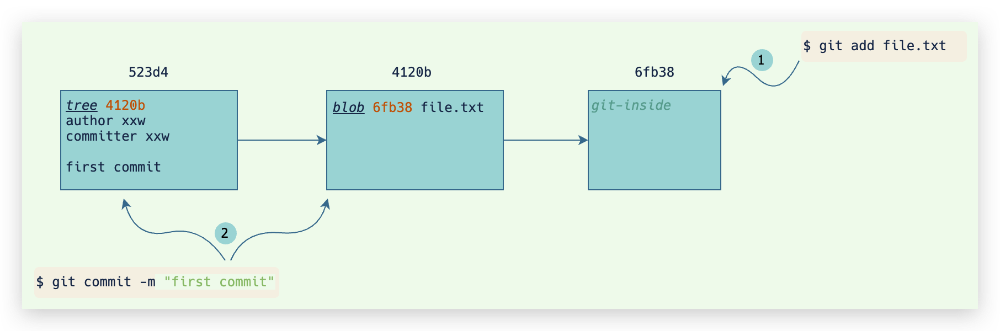
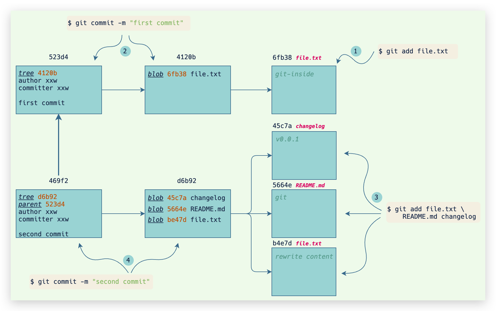

<h1 style="margin-top: 30px; margin-bottom: 15px; padding: 0px 100px; font-size: 22px; text-align: center; position: relative; font-weight: bold; color: black; line-height: 1.1em; padding-top: 12px; padding-bottom: 12px; margin: 70px 30px 30px; border: 1px solid #000; width: 60%; margin: 0 auto" data-id="heading-2"><span style="float: left; display: block; width: 60%; border-top: 1px solid #000; height: 1px; line-height: 1px; margin-left: -5px; margin-top: -17px;"> </span><span class="prefix" style="display: block; width: 3px; margin: 0 0 0 5%; height: 3px; line-height: 3px; overflow: hidden; background-color: #000; box-shadow: 3px 0 #000, 0 3px #000, -3px 0 #000, 0 -3px #000;"></span><span class="content" style="display: block; -webkit-box-reflect: below 0em -webkit-gradient(linear,left top,left bottom, from(rgba(0,0,0,0)),to(rgba(255,255,255,0.1)));">Git 底层原理</span><span class="suffix" style="display: block; width: 3px; margin: 0 0 0 95%; height: 3px; line-height: 3px; overflow: hidden; background-color: #000; box-shadow: 3px 0 #000, 0 3px #000, -3px 0 #000, 0 -3px #000;"></span><span style="float: right; display: block; width: 60%; border-bottom: 1px solid #000; height: 1px; line-height: 1px; margin-right: -5px; margin-top: 16px;"> </span></h1>
<br />

了解 git 内部原理其实很有用，比如意外删除了分支怎么办？二进制大文件占用太多磁盘空间怎么清理等等。

git 实际上是一个内容文件系统，载体是 git 的对象，存储的是一个个的内容版本。git 仓库就像一个书架，书架上放着的是一本本书，对于 git 来讲，这一本本书就是 git 对象，存储的是书的每一个版本的内容。

<div align="center"></div> 

git 的所有核心底层命令实际上都是在操作 git 对象。比如 git add 命令，就是把文件快照存储成 `blob` 对象，`git commit` 命令，就是把提交信息存储成 `tree` 对象，`git checkout -b`创建分支命令，就是创建一个指针指向 `commit` 对象。

本文会从一个空的仓库开始，一步一步讲解 git 的底层文件变动和内部原理。


##### <span style="color: #41B883; border-left:3px solid #41B883; padding-left: 5px; padding-right: 5px">0x01</span> 首先初始化工程
```bash
# 初始化工程
$ git init
Initialized empty Git repository in /Users/xxx/workspace/git-inside/.git/
# 查看目录结构
$ tree -a
└── .git
    ├── HEAD
    ├── config
    ├── description
    ├── hooks
    │   ├── applypatch-msg.sample
    │   ├── ......                  # 省略
    │   └── update.sample
    ├── info
    │   └── exclude
    ├── objects
    │   ├── info
    │   └── pack
    └── refs
        ├── heads
        └── tags

9 directories, 16 files
```

git 初始化时，实际上是在仓库下创建了一个 `.git` 目录的隐藏目录，以及一些默认的文件：
* `HEAD`: `HEAD` 指针，指向当前的操作分支，具体看 [HEAD](./git-refs.md#HEAD)。
* `config`: 存储的本地仓库的配置，具体看 [git 的配置说明](./git-config.md)。
* `description`: `description` 用来存储仓库名称以及仓库的描述信息。具体看 [./git/description](./git-internal-files.md#.git/description)。
* `hooks/*`: git 钩子，git 钩子可以做非常有用的事情，也是构建 git 工作流中不可或缺的部分。具体看 [git 钩子](./git-hooks.md)。
* `info/exclude`: 该文件的功能和 [.gitignore](./git-internal-files.md#.gitignore) 一样，都是配置 git 忽略本地文件。
* `objects/*`: git 的底层对象，具体看 [git 底层对象](./git-internal-objects.md)。
* `refs/heads` 和 `refs/tags` : git 引用，实现了git 的分支策略，具体看 [git 引用](./git-refs.md)。

##### <span style="color: #41B883; border-left:3px solid #41B883; padding-left: 5px; padding-right: 5px">0x02</span> 添加一个文件

使用 `git add` 命令把当前工作区的变更提交到暂存区：
```bash
# 添加文件
$ echo "git-inside" > file.txt
# 把文件添加到版本系统中
$ git add file.txt

$ echo "git-inside" > file.txt
$ git add file.txt
$ git commit -m "first commit"
```
此时查看 `.git/` 工作目录：

```bash
$ tree .git/objects
.git/objects
├── 6f
│   └── b38b7118b554886e96fa736051f18d63a80c85
├── info
└── pack
```

可以看到新生成了一个 git 对象，路径为`.git/objects/6f/b38b7118b554886e96fa736051f18d63a80c85`。
> git 对象的文件路径和名称根据文件内容的 [sha1](https://en.wikipedia.org/wiki/SHA-1) 值决定，取 sha1 值的第一个字节的 hex 值为目录，其他字节的 hex 值为名称。

为了减少存储大小，git 对象都是使用 [zlib](http://zlib.net/) 压缩存储的。git 对象的详细说明可以参考这里：[git 对象](./git-internal-objects.md) 。git 提供了 [cat-file](./git-internal-commands.md#git-cat-file) 命令用来格式化查看 git 对象内容：

```bash
# 查看 git 对象内容
$ git cat-file -p 6fb38b7118b554886e96fa736051f18d63a80c85
git-inside
# 查看 git 对象类型
$ git cat-file -t 6fb38b7118b554886e96fa736051f18d63a80c85
blob
```
可以看到：
* `6fb38b7`（上述 git 对象的 sha1 值简写） 对象类型为 `blob` 对象，`blob` 对象存储变更文件的内容快照。
* `6fb38b7` 对象内容为 `file.txt` 的文件内容。
> 根据 sha1 的散列特性，使用 sha1 的前 7 个字符就基本可以表示该 sha1 值。Github、Gitlab 也一样。

此时查看 `.git/` 目录下，会新增一个 index 文件（索引文件）：
```bash
$ file .git/index
.git/index: Git index, version 2, 1 entries
```
`index` 文件存储暂存区的文件列表，`index`文件代表了 git 的一个重要的概念：暂存区。`index` 文件的详细说明可以查看 [索引文件](./git-internal-objects.md#索引文件) 。
`index` 文件使用二进制方式存储暂存区信息，通过 git 提供的 [ls-file](./git-internal-commands.md#git-ls-files) 底层命令可以查看索引文件的格式化输出：

```bash
$ git ls-files -t
H file.txt
```

> 有兴趣的同学可以使用 `hexdump -C` 命令查看索引文件的二进制内容。

##### <span style="color: #41B883; border-left:3px solid #41B883; padding-left: 5px; padding-right: 5px">0x03</span> 提交到本地版本库

使用 `git commit` 命令可以把暂存区的变动提交到本地版本库中：

```bash
$ git commit -m "first commit"
[master (root-commit) 523d41c] first commit
 1 file changed, 1 insertion(+)
 create mode 100644 file.txt
```

查看 `.git/objects` 目录下，会新增 2 个 git 对象：

```bash
$  tree .git/objects
.git/objects
├── 41
│   └── 20b5f61a582cb12d4dcdaab71c7ef1862dbbca
├── 52
│   └── 3d41ce82ea993e7c7df8be1292b2eac84d4659
├── 6f
│   └── b38b7118b554886e96fa736051f18d63a80c85
├── info
└── pack
```
分别是 `523d41c` 和 `4120b5f` 。

使用 `git cat-file` 可以看到 2 个 对象的类型和内容：
```bash
# 523d41c 是一个 commit 对象
$ git cat-file -t 523d41c
commit
$ git cat-file -p 523d41c
tree 4120b5f61a582cb12d4dcdaab71c7ef1862dbbca
author xiaowenxia <775117471@qq.com> 1606913178 +0800
committer xiaowenxia <775117471@qq.com> 1606913178 +0800

first commit

# 4120b5f 是一个 tree 对象
$ git cat-file -t 4120b5f
commit
$ git cat-file -p 4120b5f
100644 blob 6fb38b7118b554886e96fa736051f18d63a80c85	file.txt
```
这里新出现了 2 种新的 git 对象类型，分别是 `tree` 对象（`523d41c`） 和 `commit` 对象（`4120b5f`），tree 对象用来记录目录结构和 blob 对象索引，commit 对象包含着指向前述 tree 对象的指针和所有提交信息。

操作到这里，git 的底层对象一共生成了 3 个，分别是：

* `6fb38b7`: blob对象。
* `4120b5f`: tree对象，指向 `6fb38b7`。
* `523d41c`: commit对象，指向 `4120b5f`。

他们之间的关系是：


##### <span style="color: #41B883; border-left:3px solid #41B883; padding-left: 5px; padding-right: 5px">0x04</span> 提交第二个版本

我们继续提交代码和文件：

```bash
$ echo "rewrite content" > file.txt
$ echo "git" > README.md
$ echo "v0.0.1" > changelog
$ git add -A
$ git commit -m "second commit"
[master 469f265] second commit
 3 files changed, 3 insertions(+), 1 deletion(-)
 create mode 100644 README.md
 create mode 100644 changelog
```
该提交修改了 `file.txt` 并新增了 `README.md` 和 `changelog` 2个文件。
查看 git 对象列表：

```bash
$ tree .git/objects
.git/objects
├── 41
│   └── 20b5f61a582cb12d4dcdaab71c7ef1862dbbca
├── 45
│   └── c7a584f300657dba878a542a6ab3b510b63aa3
├── 46
│   └── 9f265457baefd2d8352726dce7a261614fbc71
├── 52
│   └── 3d41ce82ea993e7c7df8be1292b2eac84d4659
├── 56
│   └── 64e303b5dc2e9ef8e14a0845d9486ec1920afd
├── 6f
│   └── b38b7118b554886e96fa736051f18d63a80c85
├── b4
│   └── e7d049fbb6232dc298b12c1fe5845c512faf3e
├── d6
│   └── b927d3bba2aa63359a35f849e9abb6c98d0f9e
├── info
└── pack
```

可以看到除了原先的 `6fb38b7`、`4120b5f`、`523d41c`，又新增了：
* `45c7a58`: blob 对象， 存储 `changelog` 内容快照。
* `469f265`: commit 对象，指向。
* `5664e30`: blob 对象， 存储 `README.md` 内容快照。
* `b4e7d04`: blob 对象， 存储 `file.txt` 内容快照。
* `d6b927d`: tree 对象， 指向 `45c7a58`、`5664e30`、`b4e7d04`。

查看 commit 对象内容：

```bash
$ git cat-file -p 469f265
tree d6b927d3bba2aa63359a35f849e9abb6c98d0f9e
parent 523d41ce82ea993e7c7df8be1292b2eac84d4659
author xiaowenxia <775117471@qq.com> 1606916733 +0800
committer xiaowenxia <775117471@qq.com> 1606916733 +0800

second commit
```

仔细的同学会发现，`469f265` 跟第一次提交生成的 commit 对象（`523d41c`）相比，多了一个 `parent` 字段。`parent` 字段是用来指向上一次提交的，一般是1个parent，有些情况下会是多个parent，比如 merge 这种情况。

我们再总结一下这些对象之间的关系：


这里又引申出来了 git 的一个非常重要的概念，每一次新的提交都会指向上一个提交，这样多个提交就组成了一个提交链。这个提交链涉及到了一个非常有名的算法：[merkle tree](https://baike.baidu.com/item/%E6%A2%85%E5%85%8B%E5%B0%94%E6%A0%91/22456281)。`merkle tree` 有一个重要的特性就是单独更改其中一个节点的内容就会破坏掉这个tree。git 就是通过 `merkle tree` 来保证每个版本都是连续有效的。
> 这就是为什么很难修改 git 的历史提交记录，如果要修改某一个提交，那同时还需要修改这个提交之后的所有提交，这样才能保证 `merkle tree` 是有效成立的。
> 另外，区块链也是基于 `merkle tree` 来保证数据可靠性的。

